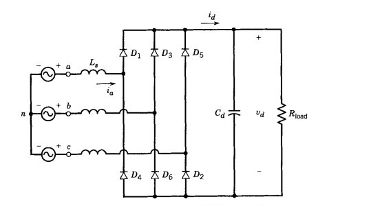
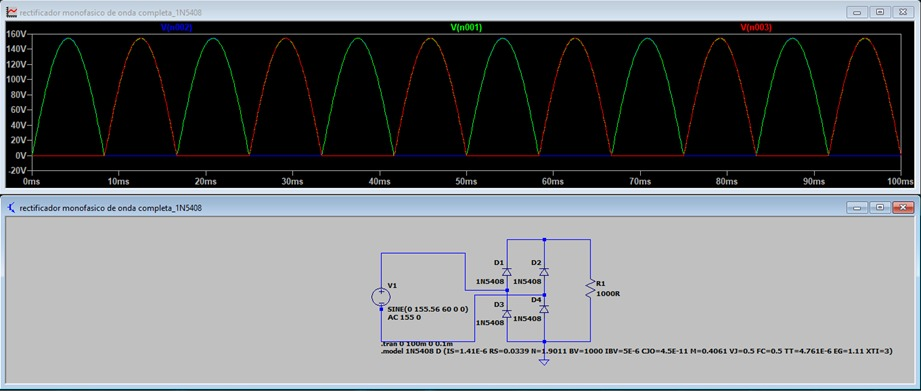
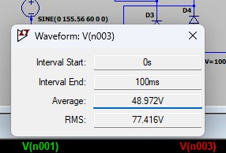

# Power Diodes: Full Overview

## 1. Power Diode Characteristics

Power diodes are semiconductor devices designed for high-voltage and high-current applications. Compared to signal diodes, they have enhanced construction for thermal handling and efficient switching.

- **Conduction State:** Allows current flow in the forward direction, with a typical forward voltage drop (0.5–1.2V for silicon).
- **Blocking State:** Prevents current in reverse, up to a rated reverse voltage (VRRM/PIV).
- **Reverse Recovery:** A key parameter is the reverse recovery time ($$t_{rr}$$), crucial for switching losses and frequency suitability.
- **Package Types:** Common formats include stud-mounted and disc packages, optimized for power dissipation.

<b>Fig. 1.</b> (I-V) characteristic of a diode. 
Image extracted from: Rashid, M. H. (2014). Power Electronics: Devices, Circuits, and Applications (4th ed.). Pearson Education..

## 2. Types of Power Diodes

| Type                     | Key Features                                        | Typical Application                     |
|--------------------------|-----------------------------------------------------|------------------------------------------|
| General-Purpose Diodes   | High current/voltage, slow recovery                 | Low-frequency rectification (50/60Hz)    |
| Fast-Recovery Diodes     | Short reverse recovery time ($$t_{rr}$$ in μs/ns)   | High-frequency converters, SMPS          |
| Schottky Diodes          | Metal-semiconductor, low forward drop (~0.3V), minimal $$t_{rr}$$ | High-efficiency, low-voltage rectification |

- **General-purpose**: Used in low-frequency, high-current rectifiers.
- **Fast-recovery**: Suitable for high-frequency circuits due to short $$t_{rr}$$.
- **Schottky**: Ideal for high-speed switching, though limited in maximum voltage ratings.

## 3. Freewheeling Diode

The freewheeling, or flyback diode, is used across inductive loads to:

- Provide a current path when the main switch turns off, suppressing voltage spikes.
- Protect switching devices from transients.
- Smooth output currents, especially important in supplies for DC motors and RL loads.

<b>Fig. 2.</b> Basic Step-Down (Buck) Converter Circuit with Low-Pass Filter and Freewheeling Diode. 
Image extracted from: Mohan, N., Undeland, T. M., & Robbins, W. P. (2003). Power Electronics: Converters, Applications, and Design (3rd ed.). John Wiley & Sons..

## 4. Diode Rectifiers

### 4.1 Single-Phase Full-Wave Rectifier

- **Bridge Rectifier:** Uses four diodes; delivers full-wave DC from AC; output voltage $$V_{DC} ≈ 0.636·V_{m}$$.
- **Center-Tapped Rectifier:** Uses two diodes and a transformer with a center tap.

<b>Fig. 3.</b> full-wave rectifier. 
Images extracteds from: Hart, D. W. (2011). Electrónica de Potencia. Pearson Educación.

### 4.2 Three-Phase Rectifiers

- **Half-wave and full-wave topologies** with three or six diodes.
- **Three-phase bridge (six-pulse):** Produces less output ripple than single-phase, suited for industrial/heavy applications.

| Topology                 | Diode Count | Ripple Factor | Common Applications           |
|--------------------------|-------------|--------------|------------------------------|
| Single-Phase Full-Wave   | 4           | ~0.48        | Low/medium power supplies     |
| Three-Phase Bridge       | 6           | ~0.05        | High-power, industrial drives |

<b>Fig. 4.</b> Three-phase, full bridge rectifier.

## 5. Performance Parameters

- **Forward Voltage Drop ($$V_{F}$$):** Lower values mean higher efficiency.
- **Peak Reverse Voltage:** Maximum reverse voltage the diode can safely block.
- **Maximum Forward Current:** Highest permissible continuous forward current.
- **Reverse Recovery Time ($$t_{rr}$$):** Important for high-frequency operation.
- **Power Dissipation:** Combination of conduction and switching losses.
- **Thermal Resistance:** Reflects the ability to handle heat produced under load.
- **Ripple Factor:** Indicates the level of AC content in the rectified output.

## 6. Rectifier Circuit Design Essentials

- **Diode Selection:** Ensure ratings for reverse voltage and current exceed application conditions (add safety margin).
- **Topology Selection:** Match rectifier design to output requirements (single or three-phase, required smoothing).
- **Filtering:** Capacitors and/or inductors are often added post-rectification to reduce output ripple.
- **Protection:** Include freewheeling diodes, fuses, and snubbers as needed.
- **Parameter Calculation:** Analyze circuit waveforms and calculate average voltage/current, rms values, and ripple.

### 6.1 Designing a rectifier circuit

To design a rectifier circuit, we first need to determine the type of rectifier (single-phase or three-phase, controlled or uncontrolled) and the arrangement of the diodes. Here is an example:

- Single-phase full-wave rectifier circuit in LTSpice:

<b>Fig. 5.</b> LTSpice simulation diagram for a single-phase rectifier using 1N1186 diodes.

- Rectified signal (green) vs original signal (blue)

<b>Fig. 6.</b> Shows how the rectified signal eliminates the negative parts, becoming a unidirectional pulsating current signal.

- Phase of a half-wave rectifier (Red)

<b>Fig. 7.</b> Shows the signal covered by the original.

- Better visualization of the complete input 

<b>Fig. 8.</b> Complete signal of the input signal.

- RMS value and average value

<b>Fig. 9.</b> Press art gr on the signal to display the box.

- The power signal (red)

<b>Fig. 10.

---

## References

1. Rashid, M. H. *Power Electronics: Devices, Circuits, and Applications*. Pearson.
2. Mohan, N., Undeland, T. M., & Robbins, W. P. *Power Electronics: Converters, Applications, and Design*. McGraw-Hill.
3. Erickson, R. W., & Maksimovic, D. *Fundamentals of Power Electronics*. Springer.
4. Hart, D. W. *Power Electronics*. Prentice Hall.

> *This summary is based on the above-listed references and does not reproduce any copyrighted illustrations or excerpts.*
