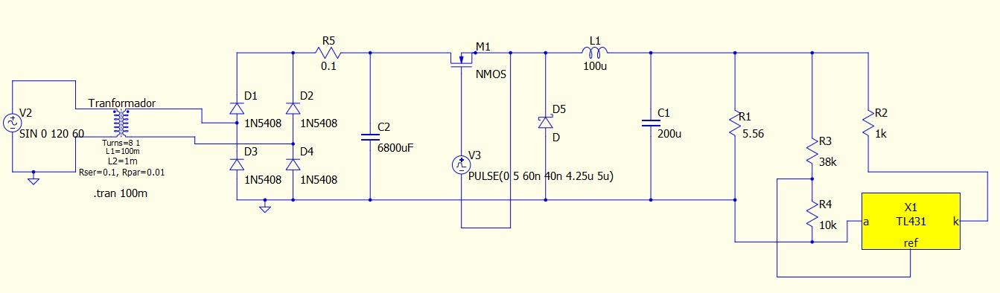

# DC–DC Converters: Buck and Boost

## 1. Introduction

**DC–DC converters** are electronic circuits that transform one level of DC voltage into another while maintaining high efficiency.  
The most common types are:

- **Buck** → reduces the input voltage.  
- **Boost** → increases the input voltage.  
- Buck–Boost, Cuk, SEPIC, among others.

They are widely used in switched-mode power supplies, chargers, embedded systems, and any application that requires efficient voltage regulation.

---

## 2. Buck Converter (Step-Down)

### 2.1 General Description
The Buck converter delivers to the load a voltage **lower** than the input voltage by controlling the duty cycle of a switch (MOSFET or IGBT).

### 2.2 Topology

---

### 2.3 Components

- `Vin` (**Vs**): input voltage source  
- `SW` (**S1**): controlled switch (MOSFET, IGBT, or transistor)  
- `D` (**FD**): freewheeling diode (or synchronous MOSFET in some designs)  
- `L`: inductor (stores and transfers energy)  
- `C`: output capacitor (filters voltage ripple)  
- `R`: load resistance (represents the load connected to the converter)  
- `Vout`: output voltage across the load  
- `Io`: output current flowing through the load

---

### 2.4 Operating Principle

The Buck converter operates in two main intervals (Continuous Conduction Mode, CCM):

1. **Switch ON:** the source transfers energy to the inductor and the load.  
2. **Switch OFF:** the inductor supplies current to the load through the diode.

In steady state (CCM):

$V_{o} = D \cdot V_{in}$

where:

- $V_{o}$: output voltage  
- $V_{in}$: input voltage  
- $D$: duty cycle ($D = t_{on} / T$)

---

### 2.5 Key Equations (Continuous Conduction Mode)

- **Output voltage:**  
  $V_{o} = D \cdot V_{in}$

- **Average inductor current:**  
  $I_{L} = I_{o} = \dfrac{V_{o}}{R}$

- **Inductor current ripple:**  
  $\Delta I_{L} = \dfrac{(V_{in} - V_{o})\,D}{L\,f_{s}}$

- **Output voltage ripple:**  
  $\Delta V_{o} = \dfrac{\Delta I_{L}}{8\,f_{s}\,C}$

> $f_{s}$ is the switching frequency.

---

### 2.6 Basic Design Guidelines

1. Choose the switching frequency according to efficiency and size requirements.  
2. Select the inductor to limit current ripple ($\Delta I_{L}$ ≤ 20–40% of $I_{L}$).  
3. Size the output capacitor to keep the voltage ripple within the desired limits.  
4. Consider conduction, switching, and series resistance losses.

---

### 2.7 Simulation Example

- Configure the circuit in **LTspice** or **Simulink**.  
- Use: $V_{in} = 12\;V$, $V_{o} = 5\;V$, $L = 100\;\mu H$, $C = 100\;\mu F$, $R = 10\;\Omega$, $f_{s} = 50\;kHz$.  
- Adjust the duty cycle:

$D = \dfrac{V_{o}}{V_{in}} = \dfrac{5}{12} \approx 0.42$

---

## 3. Boost Converter (Step-Up)

The Boost converter increases the output voltage above the input voltage.

### 3.1 Basic Equation (CCM)

$V_{o} = \dfrac{V_{in}}{1 - D}$

---

### 3.2 Notes

- Efficiency decreases at high duty cycles due to increased losses.  
- The inductor must support the input current.  
- The diode and switch must withstand the higher voltage.

---

## 4. Simulation

---

Circuit rectifier with DC-DC converter by using the TL431. 

The component intended for the DC-DC converter include the IRLZ44N MOSFET and the 1N5824 zener diode

---
## 5. Conclusions

- The Buck converter is ideal for applications where the voltage needs to be reduced with high efficiency.  
- The Boost converter allows voltage increase, though with higher complexity in control and losses.

---

## 6. References

- Hart, D. W. (2001). *Power Electronics*. Pearson Education.  
- Rashid, M. H. (2014). *Power Electronics: Devices, Circuits, and Applications*. Pearson.  
- Mohan, N., Undeland, T., Robbins, W. (2003). *Power Electronics: Converters, Applications, and Design*. Wiley.  
- Erickson, R. W. (2000). *Fundamentals of Power Electronics*. Kluwer Academic Publishers.
