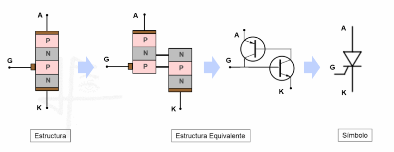

# Thyristors and Phase Control

## 1️. Thyristor Concept
A **thyristor** is a semiconductor switching device that belongs to the family of controlled electronic switches.  
Its name comes from *Thyristor* (a contraction of *Thyratron* and *Transistor*).  
The most representative member is the **SCR** (*Silicon Controlled Rectifier*).

It consists of **four alternating layers of P-type and N-type material (PNPN)**, creating three PN junctions and three terminals:

- **Anode (A):** connected to the outer P layer.  
- **Cathode (K):** connected to the outer N layer.  
- **Gate (G):** linked to the inner region.

## Thyristor structure, equivalent circuit and symbol

Its behavior is similar to that of a bistable switch:

- In the **blocking** state, it withstands the voltage between anode and cathode with only a tiny leakage current.  
- When a current pulse is applied to the gate, the device turns **on** and remains conducting as long as the anode current exceeds the **holding current**.  
- To return to the blocking state, the current must fall below that threshold or the polarity must be reversed.

The SCR is the basic type, but there are other variants: **TRIAC** (bidirectional conduction), **DIAC** (trigger device), **GTO** (*Gate Turn-Off Thyristor*), etc.  
Its main advantage is the ability to control large amounts of power using low-energy control signals.

---

## 2️. Problem Statement: Phase-Controlled Switch
In many AC (alternating current) applications, it is necessary to regulate the power delivered to a load without introducing significant losses.  
An efficient solution is to use a **phase-controlled switch**, which delays the conduction point within each half-cycle.

Operating principle:

1. During each half-cycle of the AC voltage, a **firing angle (\(\alpha\))** is set.  
2. The device conducts only from that angle to the end of the half-cycle.  
3. Increasing \(\alpha\) decreases the average power applied to the load.

Common applications:
- Light dimmers.  
- Temperature control in heaters.  
- Speed regulation in motors.

The **thyristor (SCR)** is well suited for this system because it allows precise control of the firing instant.

---

## 3️. Documentation Start: SCR, DIAC, and Trigger Circuits
### SCR (Silicon Controlled Rectifier)
- Allows current conduction in only one direction.  
- Once triggered by the gate, it remains on until the current falls below the holding value.

### DIAC
- A bidirectional trigger device.  
- Stays non-conductive until its breakover voltage is reached, at which point it conducts in either direction.  
- Used with SCRs or TRIACs to achieve stable and symmetrical triggering.

### Trigger Circuits
- **RC Network + DIAC:** a capacitor charges through a resistor in each half-cycle; once the voltage reaches the DIAC breakover voltage, it conducts and sends a pulse to the gate of the SCR or TRIAC. Adjusting the resistor (potentiometer) sets the firing angle.  
- **Optocoupler (e.g., MOC3021):** isolates the control circuit from the power stage, reducing interference.  
- **Microcontroller-based triggering:** detects the zero-crossing of the AC waveform and sends a pulse at the desired moment, providing flexible control.

---

## 4️. Commercial Components for Circuit Implementation
| Component  | Type      | Max Voltage | Max Current | Notes |
|------------|-----------|-------------|-------------|-------|
| BT151-800R | SCR       | 800 V       | 12 A        | General-purpose, requires a heatsink at higher power. |
| TIC106D    | SCR       | 400 V       | 5 A         | Suitable for medium loads. |
| MCR100-8   | SCR       | 400 V       | 0.8 A       | TO-92 package, good for low-power applications. |
| DB3        | DIAC      | 32 V (typ.) | 2 A peak    | Common trigger device for dimmers and phase control. |
| BTA16-600B | TRIAC     | 600 V       | 16 A        | Controls loads in both half-cycles. |
| MOC3021    | Optotriac | 400 V       | 100 mA      | Provides isolation between control electronics and the power stage. |

> **Note:** Always ensure the rated voltage and current exceed the maximum circuit conditions, and use heatsinks when necessary.

---

## 4️. Simulation

---

### References
- Hart, D. W. (2001). *Power Electronics*. Pearson Education.  
- Rashid, M. H. (2014). *Power Electronics: Devices, Circuits, and Applications* (4th ed.). Pearson.  
- Mohan, N., Undeland, T. M., & Robbins, W. P. (2003). *Power Electronics: Converters, Applications, and Design* (3rd ed.). Wiley.
