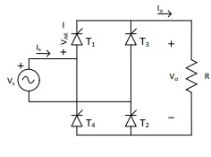

# Controlled Rectifiers

## 1️. Concept
**Controlled rectifiers** are AC-DC converters that use controllable semiconductor devices (mainly thyristors or SCRs) to convert alternating voltage into direct voltage, with the ability to regulate the output voltage through the control of the firing angle (α).

## Main Characteristics
- Output voltage control through firing angle α
- Operation in rectifier mode (0° < α < 90°)
- Operation in inverter mode (90° < α < 180°)
- Natural (line) commutation
---

## Single-Phase Fully Controlled Rectifier
### Basic Configuration

The single-phase full-wave controlled rectifier uses four thyristors (T₁, T₂, T₃, T₄) connected in a bridge configuration:

  

### Components:
- T₁, T₂, T₃, T₄: Thyristors (SCR)
- Vs: AC supply voltage (rms)
- Vo: DC output voltage
- α: Firing angle

### Operating Principle
#### Firing Sequence

| Period | Thyristors ON | Output Voltage |
|---------|---------------|-------------------|
| α → π | T₁, T₂ | Vo = Vs (positive) |
| π + α → 2π | T₃, T₄ | Vo = Vs (reflected negative) |

**Control Signals:**
- T₁ and T₂ are triggered simultaneously at ωt = α
- T₃ and T₄ are triggered simultaneously at ωt = π + α
---

## Operating Modes

### 1. Rectifier Mode  (0° < α < 90°)

$$V_o > 0$$
$$I_o > 0$$
$$P_o > 0 \text{ (power flow: AC → DC)}$$

**Applications:**
- Battery charging
- Variable DC power supply
- DC motor control

### 2.  Inverter Mode (90° < α < 180°)

$$V_o < 0$$
$$I_o > 0 \text{ (from the load)}$$
$$P_o < 0 \text{ ((power flow: DC → AC)}$$

**Requirement:**
- The load must include a voltage source (battery, motor)

**Aplicaciones:**
- Regenerative braking
- Power return to the grid

### 3. Operación en Cuatro Cuadrantes

|  Quadrant | Vo | Io | Operation |
|-----------|----|----|-----------|
| I | + | + |  Rectifier |
| II | - | + | Inverterr |
| III | - | - | Rectifier (inverted voltage) |
| IV | + | - | Inverter (inverted current) |

---

## Aplicaciones

- DC Motor Control
- Battery Chargers
- Regulated Power Supplie
- Industrial Drives

---

## 5. Simulation

---

### References
- Hart, D. W. (2001). *Power Electronics*. Pearson Education.  
- Rashid, M. H. (2014). *Power Electronics: Devices, Circuits, and Applications* (4th ed.). Pearson.  
- Mohan, N., Undeland, T. M., & Robbins, W. P. (2003). *Power Electronics: Converters, Applications, and Design* (3rd ed.). Wiley.
