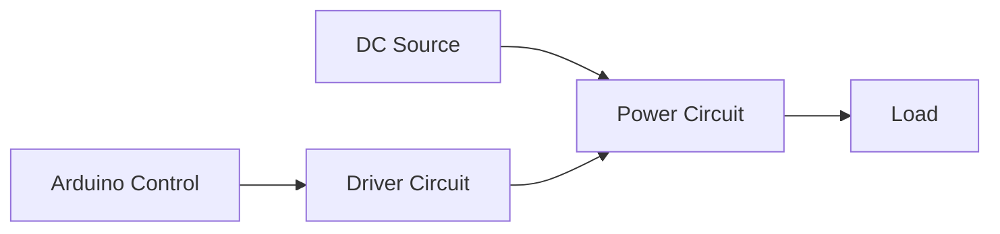

# Single Phase Inverter with Digital PWM

---

## 1. Concept

**Inverters** are power electronic circuits that convert DC voltage into AC voltage. They are essential in applications such as:


### Main Characteristics
- DC to AC power conversion
- Output voltage/frequency control through PWM techniques
- Full-bridge topology for single-phase applications
- Use of fully controllable switches (MOSFET, IGBT)

---

## 2. Full-Bridge Inverter

### Basic Configuration

The full-bridge inverter is the fundamental structure for single-phase DC-AC conversion:

### Components:
| Component | Description |
|-----------|-------------|
| **T₁, T₂, T₃, T₄** | Fully controllable switches (MOSFET, IGBT, BJT) |
| **D₁, D₂, D₃, D₄** | Antiparallel (freewheeling) diodes |
| **V_DC** | DC input voltage |
| **Load** | R-L series circuit (resistive-inductive) |

### Operating Principle

#### Switching States

| Period | Switches ON | Output Voltage |
|---------|-------------|----------------|
| 0 < t < T/2 | S₁, S₃ | u = +V_DC |
| T/2 < t < T | S₂, S₄ | u = -V_DC |

> **Key Points:**
> - Complementary switching prevents short circuits
> - Antiparallel diodes allow bidirectional current flow
> - Output voltage alternates between +V_DC and -V_DC

---

## 3. Operating Modes

### 3.1 Square Wave Inverter (Basic Mode)

#### Characteristics:
- Simplest switching scheme
- Output voltage alternates between ±V_DC
- High harmonic content

#### Output Voltage (Fourier Series):

```math
u(t) = \sum_{n(odd)} \frac{4V_{DC}}{n\pi} \sin(2n\pi ft)
```

#### Load Current (R-L Load):

**For 0 < t < T/2:**
```math
i(t) = \frac{V_{DC}}{R} + \left(I_{min} - \frac{V_{DC}}{R}\right)e^{-t/\tau}
```

**For T/2 < t < T:**
```math
i(t) = -\frac{V_{DC}}{R} + \left(I_{max} + \frac{V_{DC}}{R}\right)e^{-(t-T/2)/\tau}
```

Where: τ = L/R

---

### 3.2 Sinusoidal PWM (SPWM)

#### Principle:
Gate control signals are generated by comparing:
- **v_sine**: Sinusoidal reference signal (50 Hz)
- **v_tri**: High-frequency triangular carrier signal

#### Switching Logic:
```
When v_sine > v_tri → S₁, S₃ ON → u = +V_DC
When v_sine < v_tri → S₂, S₄ ON → u = -V_DC
```

#### Key Parameters:

**Frequency Modulation Ratio:**
```math
m_f = \frac{f_{tri}}{f_{sine}}
```

**Amplitude Modulation Ratio:**
```math
m_a = \frac{V_{m,sine}}{V_{m,tri}}
```

### 3.3 Specific Harmonic Elimination (SHE)

#### Principle:
Determine specific switching angles (θ₁, θ₂, θ₃, θ₄) to eliminate selected harmonics (typically 3rd, 5th, 7th, 9th).

#### Output Voltage Harmonics:

```math
U_n = \frac{4\sqrt{2}V_{DC}}{n\pi}\left[\frac{1}{2} - \cos(n\theta_1) + \cos(n\theta_2) - \cos(n\theta_3) + \cos(n\theta_4)\right]
```

#### System to Solve (for eliminating harmonics 3, 5, 7, 9):

```math
\begin{cases}
\frac{1}{2} - \cos(3\theta_1) + \cos(3\theta_2) - \cos(3\theta_3) + \cos(3\theta_4) = 0 \\
\frac{1}{2} - \cos(5\theta_1) + \cos(5\theta_2) - \cos(5\theta_3) + \cos(5\theta_4) = 0 \\
\frac{1}{2} - \cos(7\theta_1) + \cos(7\theta_2) - \cos(7\theta_3) + \cos(7\theta_4) = 0 \\
\frac{1}{2} - \cos(9\theta_1) + \cos(9\theta_2) - \cos(9\theta_3) + \cos(9\theta_4) = 0
\end{cases}
```
---
## 4. Classification of Inverters

### By Output:
| Type | Characteristics |
|------|----------------|
| **Square Wave** | Simple but high THD |
| **Sine Wave (PWM)** | Better quality, lower THD |

### By Source:
| Type | Usage |
|------|-------|
| **Voltage Source Inverter (VSI)** | Most common |
| **Current Source Inverter (CSI)** | Special applications |

### By Load:
| Type | Application |
|------|-------------|
| **Single Phase** | Residential applications |
| **Three Phase** | Industrial applications |

---

## 5. System Architecture

### Complete System Blocks:



### 5.1 Power Circuit Module

#### Components:
- 4× MOSFET **IRF530**
- 4× Antiparallel Diodes **1N4007**
- DC Source (**12V**)
- R-L Load (R = 25Ω, L = 100mH)

---

#### Components per Driver:
| Component | Quantity | Purpose |
|-----------|----------|---------|
| Resistor 1kΩ | 2 | Signal limiting |
| Resistor 47Ω | 2 | Gate resistors |
| Capacitor 22μF/50V | 1 | Bootstrap |
| Capacitor 100nF | 1 | Decoupling |
| Diode 1N4007 | 1 | Bootstrap |

#### Complete Bill of Materials:

| Component | Quantity |
|-----------|----------|
| MOSFET IRF540 | 4 |
| Driver IR2110 | 2 |
| Diode 1N4007 | 6 |
| Resistor 47Ω | 4 |
| Resistor 1kΩ | 4 |
| Capacitor 22μF/50V | 2 |
| Capacitor 100nF | 2 |

---

## 6. PWM Modulation Techniques Comparison

| Technique | THD | First Harmonic | Filtering | Complexity |
|-----------|-----|----------------|-----------|------------|
| **Square Wave** | 48.3% | Near fundamental | Difficult | Low  |
| **SPWM** | 28.3% | 7× fundamental | Easier | Medium  |
| **SHE** | Lowest | 11× fundamental | Easiest | High  |

---

## 7. Applications

### Industrial Applications:
- **Motor Drives**: Variable frequency drives (VFD)
- **Industrial Equipment**: Induction heating, welding
- **Power Quality**: Active filters, FACTS devices

### Renewable Energy:
- **Solar Inverters**: PV systems
- **Wind Power**: Grid connection
- **Energy Storage**: Battery systems

### Commercial & Residential:
- **UPS Systems**: Backup power supply
- **Home Appliances**: Inverter air conditioners, refrigerators
- **Electric Vehicles**: DC battery to AC motor

---

## 8. Implementation with Arduino

### 8.1 Square Wave Code Structure:

```CODE 1
void setup() {
  pinMode(7, OUTPUT);
}

void loop() {
  // Define frequency and half-period
  int halfPeriod = 1250; // for 400Hz
  
  // Toggle output pin HIGH/LOW
  digitalWrite(7, HIGH);
  delayMicroseconds(halfPeriod);
  
  digitalWrite(7, LOW);
  delayMicroseconds(halfPeriod);
}
```

---

### 8.2 SPWM Code Structure:

```CODE2
// Pre-calculated intersection points from MATLAB
float switchingTimes[] = {0.0008, 0.0019, 0.0040, 0.0045, 
                          0.0068, 0.0075, 0.0094, 0.0108, 
                          0.0119, 0.0140, 0.0145, 0.0168, 
                          0.0175, 0.0194};

void setup() {
  pinMode(7, OUTPUT);
}

void loop() {
  // Implement precise timing control
  // Based on pre-calculated switching times
}
```
---

### 8.3 SHE Code Structure:

```CODE3
// Pre-calculated angles from MATLAB
float theta1, theta2, theta3, theta4;

void setup() {
  pinMode(7, OUTPUT);
  // Load angles from MATLAB calculation
}

void loop() {
  // Implement angle-based switching
  // Ensure symmetry in output waveform
}
```
---

## 10. Simulation

---

## References

1. **Hart, D. W.** (2011). *Power Electronics*. McGraw-Hill.
2. **Rashid, M. H.** (2006). *Power Electronics Handbook: Devices, Circuits and Applications* (2nd ed.). Elsevier Academic.
3. **Mohan, N., Undeland, T. M., & Robbins, W. P.** (2003). *Power Electronics: Converters, Applications, and Design*. Wiley.
4. **Arduino Official Documentation**: [https://www.arduino.cc](https://www.arduino.cc)
5. **IR2110 Datasheet**: High and Low Side Driver - International Rectifier

---
**License:** Creative Commons Attribution 4.0 International License

**Authors:** Based on the work by Youssef, M., Aloui, F., Boubahri, C., & Fetni, S. (2020)

**Last Updated:** November 2024
