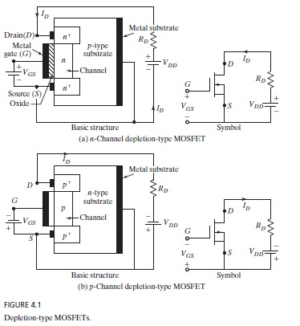
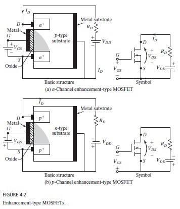
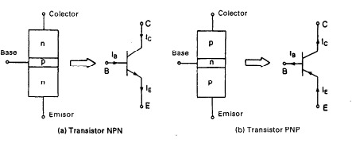

## Module 2: Power Transistor

-Junction field-effect transistors (JFETs)

-Metal oxide silicon field-effect transistors (MOSFETs)

-Bipolar junction transistors (BJTs)

-Insulated-gate bipolar transistors (IJBTs)

## Power MOSFET
  

<b>Fig. 1

  

<b>Fig. 2

## Junction Field-Effect Transistors (JFETs)
  

<b>Fig. 3

## Bipolar Junction Transistors (BJTs)

  

<b>Fig. 4

