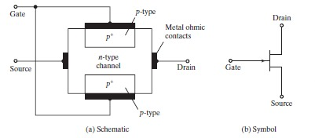

# Power Transistors

Power transistors enable controlled switching of electrical signals in high-current and high-voltage applications.  
They are widely used in **DC-DC** and **DC-AC** converters, usually paired with antiparallel diodes to allow bidirectional current flow.

The three main families are:
- **MOSFETs (Metal-Oxide-Semiconductor Field-Effect Transistors)**
- **JFETs (Junction Field-Effect Transistors)**
- **BJTs (Bipolar Junction Transistors)**

---

## 1. Power MOSFET

**MOSFETs** are voltage-controlled devices.  
They are characterized by their **high switching speed** and **low on-state resistance (R_DS(on))**, which makes them very efficient in high-frequency applications such as switched-mode power supplies and DC-DC converters.

### 1.1 Depletion-Type MOSFET
  
**Figure 1.** Structure and symbol of depletion-type MOSFET.  
📖 *Rashid, M. H. (2014). Power Electronics: Devices, Circuits, and Applications (4th ed.), Fig. 4.1, Pearson.*

### 1.2 Enhancement-Type MOSFET
  
**Figure 2.** Structure and symbol of enhancement-type MOSFET.  
📖 *Rashid, M. H. (2014). Power Electronics: Devices, Circuits, and Applications (4th ed.), Fig. 4.2, Pearson.*

The drain current in saturation mode is given by:

\[
I_D = k \cdot (V_{GS} - V_{th})^2
\]

---

## 2. Junction Field-Effect Transistor (JFET)

The **JFET** is a field-effect transistor in which the channel is controlled by a pn junction.  
Its main advantages are **high input impedance** and **low noise**, although it is less common in power applications compared to MOSFETs.

  
**Figure 3.** Structure and symbol of a JFET.  
📖 *Hart, D. W. (2011). Power Electronics. Prentice Hall. Chapter 2.*

---

## 3. Bipolar Junction Transistors (BJTs)

**BJTs** are current-controlled devices.  
They can handle high current levels but have slower switching times compared to MOSFETs.  

Basic operation:

\[
I_C = \beta I_B
\]

Power dissipation:

\[
P = V_{CE} \cdot I_C
\]

  
**Figure 4.** Structure and symbols of NPN and PNP BJTs.  
📖 *Mohan, N., Undeland, T. M., & Robbins, W. P. (2003). Power Electronics: Converters, Applications, and Design (3rd ed.), Chapter 5, McGraw-Hill.*

---

## 4. Comparison of Power Transistors

| Type   | Advantages                        | Disadvantages                     | Applications |
|--------|----------------------------------|-----------------------------------|--------------|
| MOSFET | High speed, low R_DS(on)         | Limited at very high power levels | DC-DC converters, SMPS |
| BJT    | High current handling capability | Slow switching, current-driven    | Amplifiers, low-frequency inverters |
| IGBT   | Combines MOSFET + BJT benefits   | Slower than MOSFET, more costly   | Motor drives, renewable energy inverters |

📖 *Erickson, R. W., & Maksimovic, D. (2001). Fundamentals of Power Electronics. Springer.*

---

## 5. Key Performance Parameters

- **Maximum voltage rating** (\(V_{DSmax}, V_{CEmax}\))  
- **Maximum current** (\(I_D, I_C\))  
- **Power losses**:  
  \[
  P_{total} = P_{cond} + P_{sw}
  \]  
- **Switching time** (turn-on, turn-off)  
- **SOA (Safe Operating Area)**  
- **Thermal resistance** and heat dissipation  

---

## 6. Conclusions

- Power transistors are the **foundation of modern power conversion systems**.  
- Device choice depends on application:  
  - High frequency → **MOSFET**  
  - High current → **BJT**  
  - Medium/high power → **IGBT**  

---

# Additional Questions

### Which transistor is used the most and why?
The **MOSFET** is the most widely used transistor today in switched-mode power supplies, DC-DC converters, and high-frequency electronics.  
This is because of its **high switching speed, low conduction losses, and voltage-controlled operation** (no need for base current as in BJTs).  

**IGBTs** are also common, but mainly in **industrial high-power systems** such as motor drives and renewable energy converters.  

---

### Which configuration is used the most: common-emitter or common-base?
The **common-emitter configuration** is the most widely used because:  
- It provides **high current and voltage gain**.  
- It is suitable for both **amplification** and **switching applications**.  
- Common-base configuration is only used in specialized cases (impedance matching, RF applications).  

---
