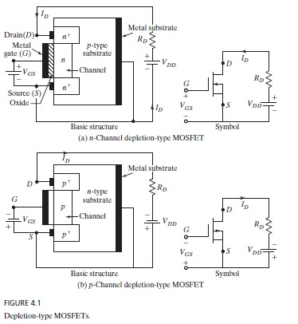
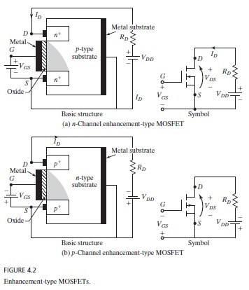
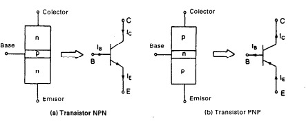

# Power Transistors

Power transistors enable controlled switching of electrical signals in high-current and high-voltage applications.  
They are widely used in **DC-DC** and **DC-AC** converters, usually paired with antiparallel diodes to allow bidirectional current flow.

The two main families studied here are:
- **MOSFETs (Metal-Oxide-Semiconductor Field-Effect Transistors)**
- **BJTs (Bipolar Junction Transistors)**

---

## 1. Power MOSFET

**MOSFETs** are voltage-controlled devices [1].  
They are characterized by their **high switching speed** and **low on-state resistance** ($R_{\mathrm{DS(on)}}$), which makes them very efficient in high-frequency applications such as switched-mode power supplies and DC-DC converters.

### 1.1 Depletion-Type MOSFET
  
**Figure 1.** Structure and symbol of depletion-type MOSFET.  
From Rashid (2014) [1].

### 1.2 Enhancement-Type MOSFET
  
**Figure 2.** Structure and symbol of enhancement-type MOSFET.  
From Rashid (2014) [1].

**Key equations (typical large-signal model):**
- **Saturation (constant-current) region:**  
  $I_D = k\,(V_{GS}-V_{th})^{2}$, valid for $V_{DS} \ge V_{GS}-V_{th}$.
- **Triode/ohmic region:**  
  $I_D = k\!\left[(V_{GS}-V_{th})\,V_{DS}-\tfrac{1}{2}V_{DS}^{2}\right]$, valid for $V_{DS} < V_{GS}-V_{th}$.
- **Conduction loss (approx.):**  
  $P_{\text{cond}} \approx I_{\text{rms}}^{2}\,R_{\mathrm{DS(on)}}$.
- **Switching loss (per cycle):**  
  $P_{\text{sw}} \approx f_{s}\,(E_{\text{on}}+E_{\text{off}})$.
- **Gate-drive power (practical):**  
  $P_{\text{gate}} \approx Q_{g}\,V_{GS}\,f_{s}$.

---

## 2. Bipolar Junction Transistors (BJTs)

**BJTs** are current-controlled devices [2].  
They can handle high current levels but have slower switching times compared to MOSFETs.

**Basic operation:** $I_C = \beta\, I_B$  

**Power dissipation (switch in conduction):** $P \approx V_{CE(\text{sat})}\,I_C$

  
**Figure 3.** Structure and symbols of NPN and PNP BJTs.  
From Mohan et al. (2003) [2].

---

## 3. Comparison of MOSFET and BJT

| Type   | Advantages                             | Disadvantages                          | Typical Applications |
|--------|----------------------------------------|----------------------------------------|---------------------|
| MOSFET | High speed, low $R_{\mathrm{DS(on)}}$  | Limited at very high power levels      | DC-DC converters, SMPS |
| BJT    | High current handling capability       | Slower switching, current-driven base  | Amplifiers, low-frequency inverters |

From Erickson & Maksimovic (2001) [3].

---

## 4. Key Performance Parameters

- **Maximum voltage rating** ($V_{DS,\max}$, $V_{CE,\max}$)  
- **Maximum current** ($I_D$, $I_C$)  
- **Total power losses:** $P_{\text{total}} = P_{\text{cond}} + P_{\text{sw}}$  
- **Switching times** (turn-on, turn-off)  
- **SOA (Safe Operating Area)**  
- **Thermal resistance** and heat dissipation  

---

## 5. Conclusions

- MOSFETs dominate **high-frequency and low/medium-power** applications due to their fast switching and low conduction losses.  
- BJTs are still useful in **high-current, low-frequency** applications.  
- The choice between MOSFET and BJT depends on switching frequency and power requirements.  

---

# Additional Questions

### Which transistor is used the most and why?
The **MOSFET** is the most widely used transistor today in switched-mode power supplies, DC-DC converters, and high-frequency electronics [1].  
It dominates because of its **high switching speed**, **low conduction losses** ($R_{\mathrm{DS(on)}}$), and **voltage-controlled gate** (no continuous drive current as in BJTs).  

### Which configuration is used the most: common-emitter or common-base?
The **common-emitter** configuration is used far more often [2][3] because it provides **high current and voltage gain** and works well for both **amplification** and **power switching**.  
The **common-base** configuration is reserved for niche cases (e.g., RF or impedance-matching stages).

---

# References

[1] Rashid, M. H. (2014). *Power Electronics: Devices, Circuits, and Applications* (4th ed.). Pearson.  
[2] Mohan, N., Undeland, T. M., & Robbins, W. P. (2003). *Power Electronics: Converters, Applications, and Design* (3rd ed.). McGraw-Hill.  
[3] Erickson, R. W., & Maksimovic, D. (2001). *Fundamentals of Power Electronics*. Springer.
